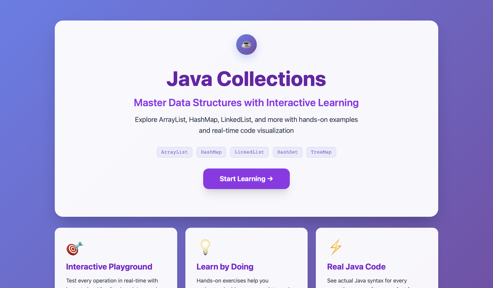
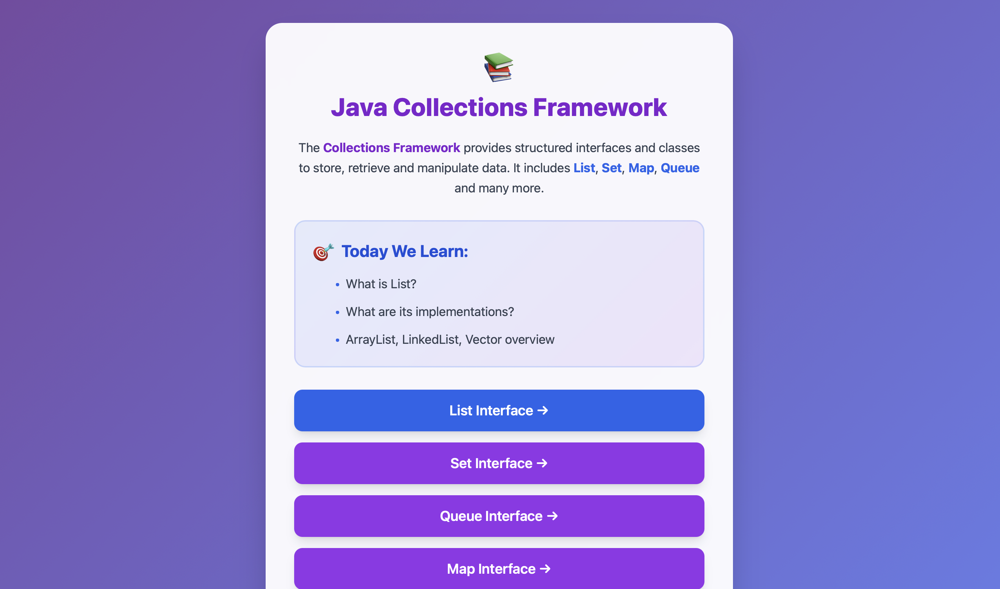
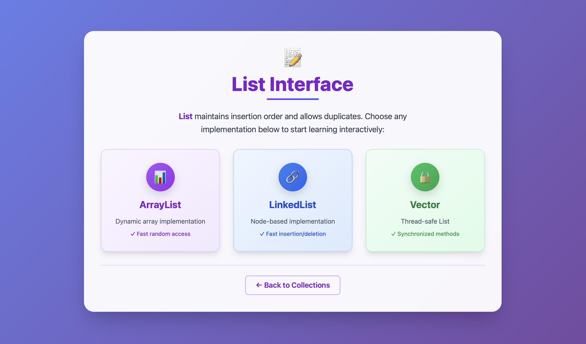
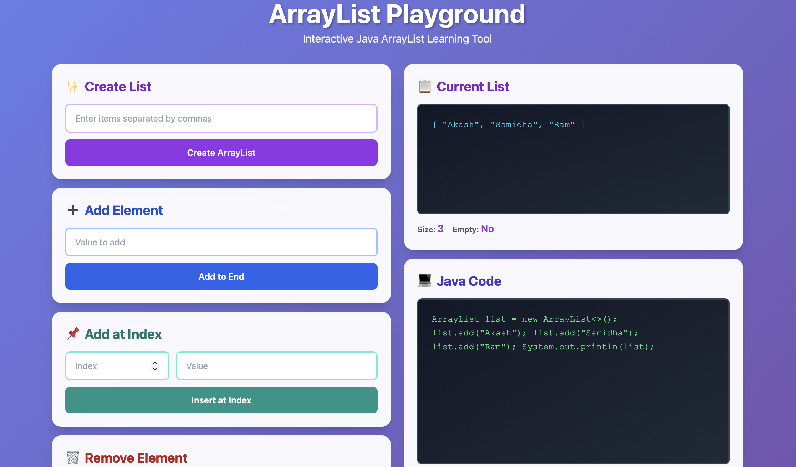
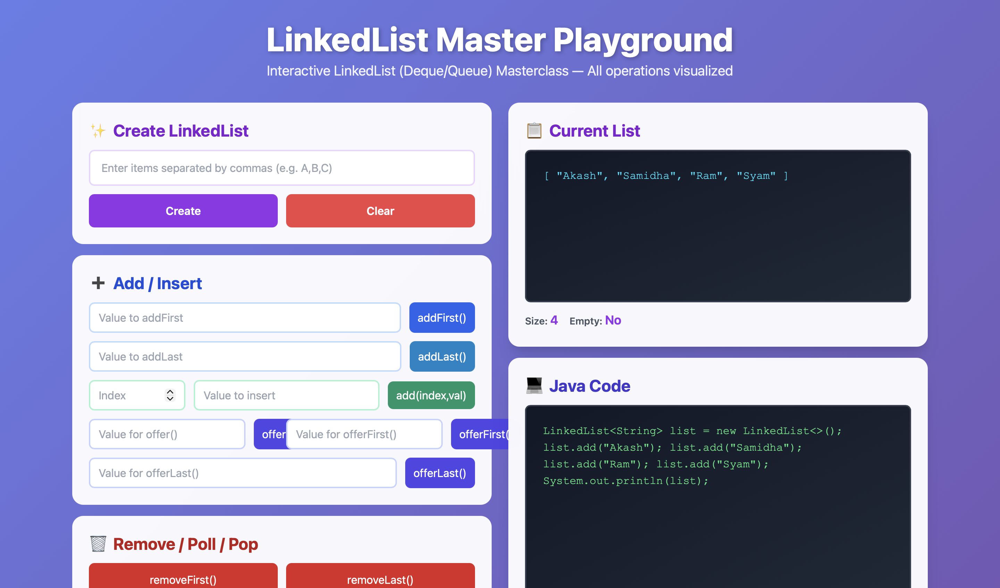
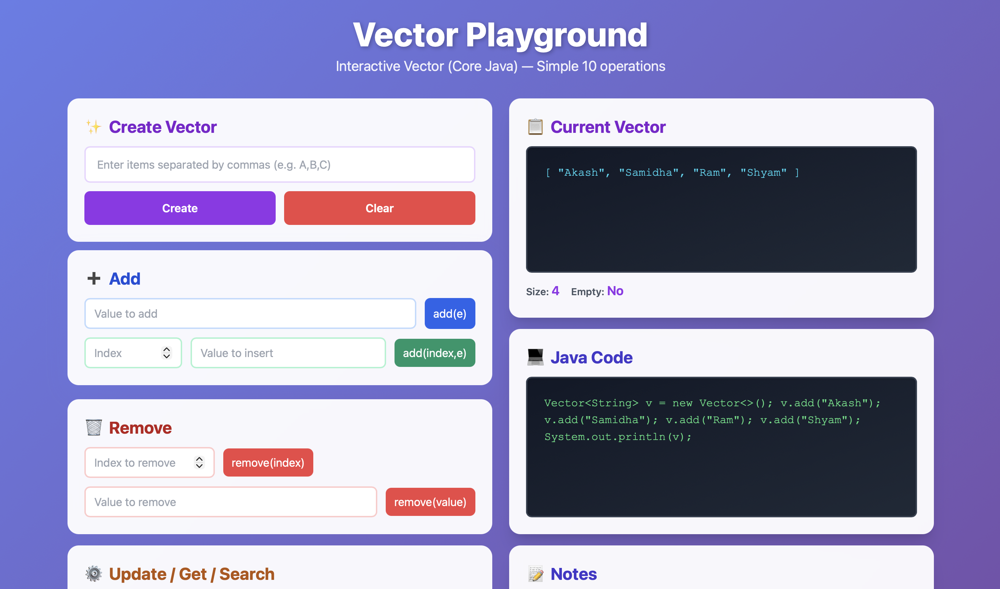

<p align="center">      </p>
# ☕ Java Collections Interactive Learning Tool  
### Master Java Collections with Interactive UI + Live Code

This project is a **visual, interactive learning platform** created to help students understand Java Collections Framework easily with:

✔ Hands-on UI  
✔ Real-time structure preview  
✔ Auto-generated Java code  
✔ Notes + explanations for every operation  
✔ Beautiful animated Tailwind UI  

---

# 🚀 Start the Application

Run the Spring Boot project:

```bash
mvn spring-boot:run
```

Then open:

👉 **http://localhost:8080/homepage.html**

---

# 📸 Screenshots

### 🏠 Homepage  


### 📚 Collections Overview  


### 📝 List Interface  


---

## 🔡 ArrayList Playground  


## 🔗 LinkedList Playground  


## 📦 Vector Playground  


---

# 📂 Project Structure

```
Collection-dev/
│
├── Java_Collection_UI/
│   ├── screenshots/
│   │   ├── homepage.png
│   │   ├── collections.png
│   │   ├── list.png
│   │   ├── arraylist.png
│   │   ├── linkedlist.png
│   │   ├── vector.png
│   │
│   ├── src/main/java/
│   │   ├── controller/
│   │   ├── config/
│   │
│   ├── src/main/resources/static/
│       ├── homepage.html
│       ├── collections.html
│       ├── list.html
│       ├── arraylist.html
│       ├── linkedlist.html
│       ├── vector.html
│
└── README.md
```

---

# 🎯 Features

| Feature | Description |
|--------|-------------|
| 🌈 Beautiful UI | Developed with TailwindCSS + animations |
| 🧪 Interactive Playground | Test operations visually |
| 💻 Auto Java Code | Shows real code for every operation |
| 🔍 Operation Notes | What, why, when to use |
| 📦 Supports | ArrayList, LinkedList, Vector |
| 🚀 Future Ready | Set, Map, Queue coming soon |
| 📚 Student Friendly | Perfect for teaching and revision |

---

# 🛠 How to Run Locally

### 1️⃣ Clone the repo:
```bash
git clone https://github.com/BalkundeAkash/Collection-dev.git
```

### 2️⃣ Open the folder in STS / IntelliJ

### 3️⃣ Run Spring Boot:
```bash
mvn spring-boot:run
```

### 4️⃣ Open the app:
```
http://localhost:8080/homepage.html
```

---

# 📌 Upcoming Features

| Interface | Status |
|----------|--------|
| Set (HashSet, LinkedHashSet) | 🚧 Launching Soon |
| Queue (PriorityQueue, ArrayDeque) | 🚧 Launching Soon |
| Map (HashMap, TreeMap) | 🚧 Launching Soon |
| Navigation Flow for All Pages | ✔ Existing |
| React Version | 🚧 Planned |

---

# 🤝 Contribute

Pull requests are welcome!

To contribute:

```
1. Fork the repo
2. Create a new branch (feature/my-feature)
3. Commit your changes
4. Push the branch
5. Open a Pull Request
```

---

# 👨‍💻 Author  
### **Akash Balkunde**  
Building beautiful tools to make **Java learning easier** for everyone.

If you like this project, ⭐ star the repository! 💜
